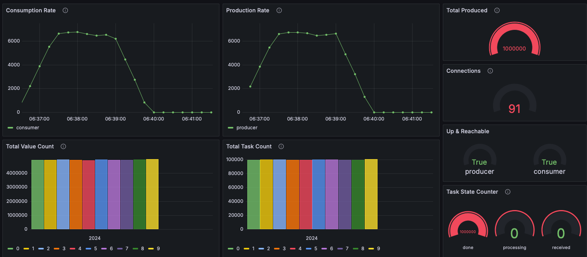

# Golang Producer-Consumer Task

## Overview
This project implements two Golang services: a **Task Producer** and a **Task Consumer**. These services demonstrate key concepts such as inter-service communication, Prometheus monitoring,
Grafana visualisation, database migrations, and profiling.

- **Task Producer**: Generates tasks, saves them in the database, and sends them to the consumer.
- **Task Consumer**: Processes tasks received from the producer and updates their states in the database.

The project uses **gRPC** for inter-service communication and **PostgreSQL** as the database.

---

## Features
- **Inter-Service Communication**: gRPC-based communication between Producer and Consumer.
- **Database Integration**: PostgreSQL with migrations handled by `golang-migrate`.
- **Prometheus Metrics**:
    - Track the number of tasks being processed.
    - Monitor the total tasks completed and tasks per type.
- **Profiling**: Integrated Go `pprof` for CPU and memory profiling.
- **Visualization**: Grafana dashboards to monitor task states and processing trends.

---

## Architecture
```plaintext
Task Producer (gRPC Client)  -->  Task Consumer (gRPC Server)
           ↕                              ↕
   Database (state: "received")    Database (state: "processing" → "done")
```
## Prerequisites
- **Go**: v1.18 or later
- **Docker**: For PostgreSQL and Prometheus/Grafana
- **Protobuf Compiler**: For gRPC code generation
- **sqlc**: For sql code generation
- **Make**: (Optional) To simplify build and run commands

## How to run
- Clone the repo
- Create .env inside, check out env-example.txt
- Run ```make compose``` to start containers
- Run ```make consumer``` to start consumer
- Run ```make producer``` to start producer (in a separate terminal)

To see grafana visualization, go to ```localhost:3000```, ```admin:admin```, dashboard called ```Tasks``` is provisioned.
To see postgres, you can use ```pgadmin```, go to ```localhost:15080```, ```a@b.c:admin```.

## Makefile
**Code Generation**
- ```make sqlc_gen``` - Generates database interaction code from SQL files in the db directory using sqlc
- ```make proto_gen```- Compiles ```consumer.proto``` into Go code for gRPC services in the proto/consumer/gen directory

**Service Execution**
- ```make producer``` - Runs the Task Producer service with version information and optimized binary size via ldflags
- ```make producer_pgo``` - Runs the producer with profiling optimizations using ```./profiles/prd_cpu.pgo```
- ```make consumer``` - Runs the Task Consumer service with similar optimizations
- ```make consumer_pgo``` - Runs the consumer with profiling optimizations using ```./profiles/csm_cpu.pgo```

**Database Migrations**
- ```make migrate``` - Migrates the database forward by one step
- ```make drop``` - Rolls back the last applied migration

**Container Management**
- ```make compose```- Starts Docker containers (e.g., PostgreSQL, Prometheus, Grafana) using ```docker-compose```
- ```make compose_clean``` - Stops and removes containers, including volumes

**Testing**
- ```make test_unit``` - Executes unit tests in the ```internal``` package
- ```make test_integration``` - Executes integration tests in the ```test``` package with verbose output

**Configuration Explanation**
- ```make explain``` - Explains the current configuration for the producer, consumer, and migrator services

**Version Information**
- ```make version``` - Displays the version information for each service (producer, consumer, and migrator)

**Profiling**

Makefile supports profiling using pprof and generates CPU, goroutine, and heap profiles for both the consumer and producer.
Run these commands when both services are under the load.

- ```make consumer_cpu``` - CPU Profile
- ```make consumer_goroutine``` - Goroutine Profile
- ```make consumer_heap``` - Heap Profile

Those commands will open web ui where also possible to see a flame graph.
The same commands are implemented for producer ```make producer_...```

It is also possible to download profiles to ```profiles``` folder, using commands
- ```make consumer_profiles``` - downloads three files from consumer server, and saves as ```.pprof``` in ```profiles``` folder
The same with the producer.
- ```make profiles``` - downloads three files from ```consumer``` and three files from ```producer```

To update pgo files just run ```cp prd_cpu.pprof prd_cpu.pgo```, ```cp csm_cpu.pprof csm_cpu.pgo``` inside ```profiles``` folder.